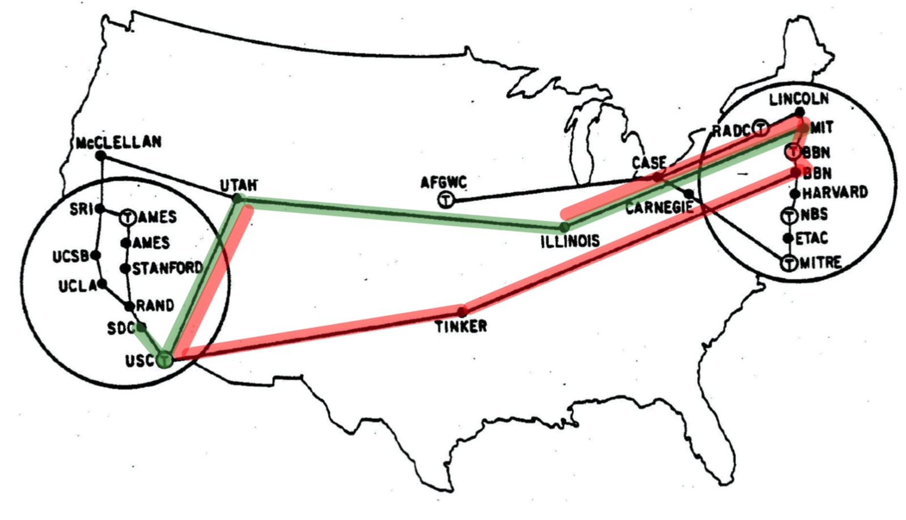
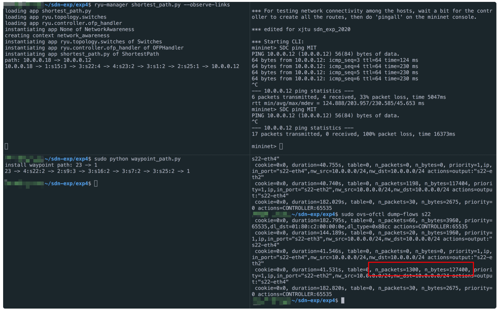
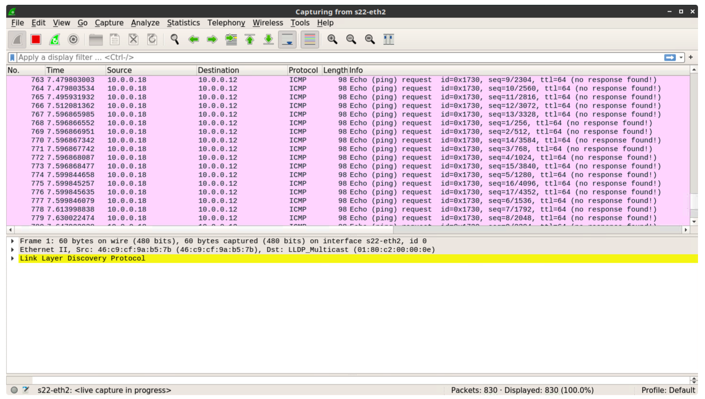
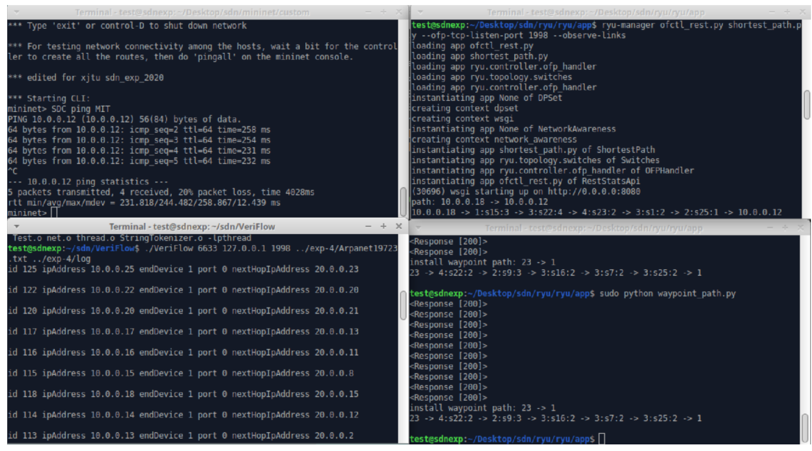
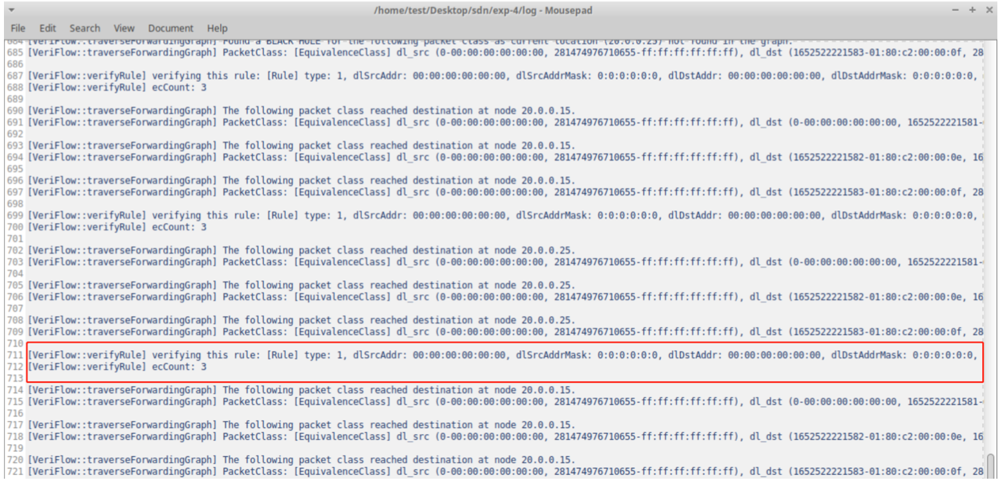
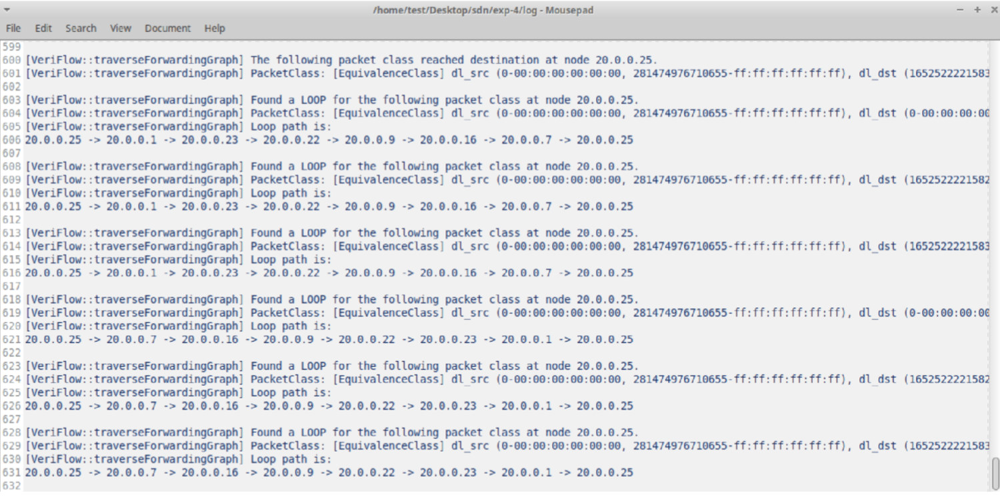
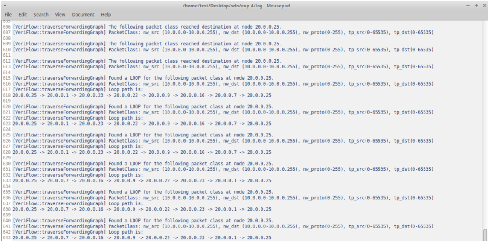
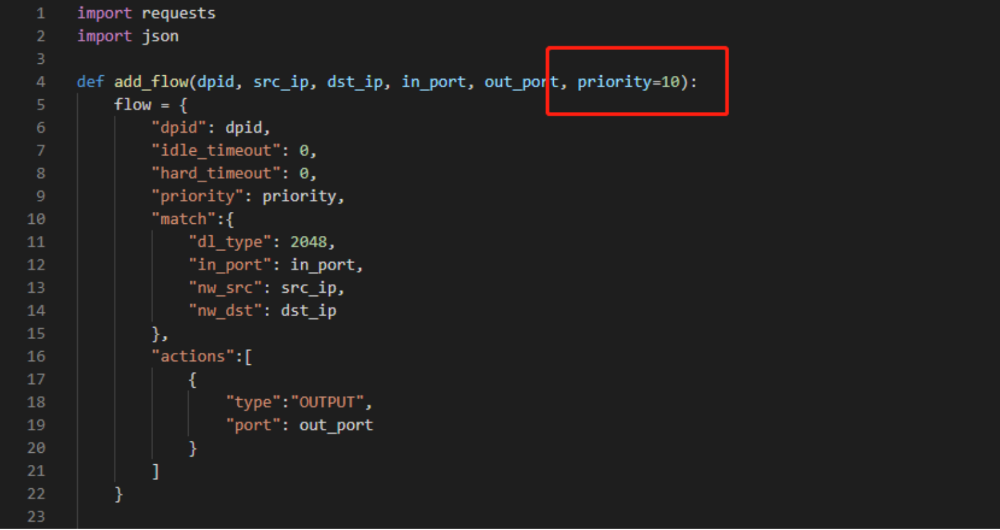

<h1 align="center">实验指导书（四）</h1>


[toc]

## 下载项⽬

```bash
git clone --recurse-submodules https://github.com/XJTU-NetVerify/sdn-lab4.git
cd sdn-lab4
```

## 实验目的

- 理解网络中网络故障出现的必然性
- 理解网络验证工具`veriflow`的原理
- 掌握`veriflow`的检测网络故障的方法

## 问题背景

`TINKER`处建立了一个流量分析中心，为了保证`UTAH`和`ILLINOIS`之间的流量可以在`TINKER`进行分析，你下发了图中的红色路径。你的同事Bob接到了另外一个需求，要求建立从`SDC`到`MIT`跳数最少的路径，即图中的绿色路径。不同的路径需求来自不同的用户，没有经过协调，产生了一个转发环路。请你运行**VeriFlow**工具，对上述两条转发路径进行检查，完成以下实验内容。



## VeriFlow使用说明

- 如何观察转发的环路问题？

```
# 1. 启动拓扑
sudo ./topo_1972.py

# 2. 启动最短路径的控制程序
uv run osken-manager ofctl_rest.py shortest_path.py --observe-links

# 3. 在拓扑中SDC ping MIT建立连接
mininet> SDC ping MIT

# 4. Bob下发从UTAH途经TINKER到达ILLINOIS的路径之后，你尝试SDC ping MIT失败
sudo python waypoint_path.py

# 5. 查看路径上某一个交换机，如USC的流表，发现匹配某一条流表的数据包数目异常增加
# 也可打开wireshark观察该端口，发现不断增加的ICMP Request报文
sudo ovs-ofctl dump-flows s22
```





- 最短路径算法中为何使用rest api下发流表？

  由于VeriFlow仅支持OpenFlow1.0，`shortest_path.py` 与 `waypoint_path.py` 中使用rest api更简便。rest api所用到的文件 `ofctl_rest.py` 位于路径ryu/ryu/app/中

- 如何使用VeriFlow

```
# 0. 从github下载VeriFlow并打上实验补丁
git clone https://github.com/samueljero/BEADS.git
cd BEADS
git am 0001-for-xjtu-sdn-exp-2020.patch

# 1. 编译VeriFlow
cd veriflow/VeriFlow
make clean all

# 2. 在自定义端口开启远程控制器，运行最短路程序
uv run osken-manager ofctl_rest.py shortest_path.py --ofp-tcp-listen-port 1024 --observe-links

# 3. 运行VeriFlow的proxy模式
VeriFlow的proxy模式的cmd格式为：
VeriFlow <veriflow_port> <controller_address> <controller_port> <topology_file> <log_file>
可用如下命令运行VeriFlow的proxy模式：
./VeriFlow 6633 127.0.0.1 1024 Arpanet19723.txt log_file.txt

# 4. 启动拓扑
sudo python Arpanet19723.py

# 5. 在拓扑中SDC ping MIT建立连接
mininet> SDC ping MIT

# 6. 下发从UTAH途经TINKER到达ILLINOIS的路径，在log文件中观察VeriFlow检测到的环路信息
sudo python waypoint_path.py
```



- VeriFlow源码中的主要类或函数

```
# 1. VeriFlow::main()
VeriFlow的程序入口，规定了test模式和proxy模式的调用格式

# 2. VeriFlow::parseTopologyFile()
VeriFlow解析拓扑文件，建立网络模型的函数，规定了拓扑文件的格式

# 3. VeriFlow::handleVeriFlowConnection()
处理socket连接关系的函数，每个连接拥有两个单向通信线程，实现控制器和交换机之间的双向通信

# 4. OpenFlowProtocolMessage::process()
处理OpenFlow消息的入口函数，根据消息的类型调用相应的处理函数

# 5. OpenFlowProtocolMessage::processFlowRemoved()
处理OFPT_FLOW_REMOVED消息的函数

# 6. OpenFlowProtocolMessage::processFlowMod()
处理OFPT_FLOW_MOD消息的函数

# 7. EquivalenceClass
表示VeriFlow定义的等价类的数据结构，包括每个域的名称和存储的顺序

# 8. VeriFlow::verifyRule()
执行VeriFlow核心算法的函数，包括对等价类的划分、转发图的构造与不变量的验证

# 9. VeriFlow::traverseForwardingGraph()
遍历某个特定EC的转发图，验证是否存在环路或黑洞
```

## 基础实验部分

现要求你运行VeriFlow工具，对上述两条转发路径进行检查，完成下述基础实验

1. 输出每次影响EC的数量
2. 打印出环路路径的信息
3. 进一步打印出环路对应的EC的相关信息
4. 分析原始代码与补丁代码的区别，思考为何需要添加补丁

### 结果示例

- EC数目的打印
  对每条验证的规则，实验要求输出这条规则所影响的EC数目
  

- 环路路径的打印
  本实验要求打印出环路的信息，包括出现环路的提示信息，EC的基本信息和环路路径上的IP地址
  提示：traverseForwardingGraph函数中的visited为unordered_set，可改成有序的数据结构
  

- 相关数据包信息的打印
  EC的基本信息显示为14个域的区间形式，为方便Bob查错，现简化EC信息的表示形式，仅从14个域中提取TCP/IP五元组作为主要信息显示
  提示：在环路路径打印的基础上，修改EC的显示格式
  

- 分析原始代码与补丁代码的区别，思考为何需要添加补丁
  添加完补丁之后，可用以下命令查看补丁修改的文件内容，按q退出。（提示：可以先运行未打补丁的VeriFlow代码，将其输出结果与实验中的结果进行比较，再结合`git diff`显示的代码修改内容，得出打补丁的原因）

```
git diff HEAD origin/HEAD
```

#### 


## 拓展实验部分


1. 若修改`waypoint_path.py`代码中被添加规则的优先级字段，VeriFlow的检测结果会出错，试描述错误是什么，并解释出错的原因
2. 在VeriFlow支持的14个域中，挑选多个域（不少于5个）进行验证，输出并分析结果

### 结果示例

- 试修改`waypoint_path.py`代码中被添加规则的优先级字段，将10修改为1，VeriFlow的检测结果会出错，试描述错误是什么，并解释出错的原因（提示：利用`dump-flows`命令可以观察到，在OVS中，匹配字段相同的两个规则，若优先级也相同，新规则会覆盖掉旧的规则）



- 在VeriFlow支持的14个域中，挑选多个域（不少于5个）进行验证，输出并分析结果

实验设计的参考步骤

```
# 1. 阅读给出的VeriFlow的主要类或函数，明确VeriFlow支持验证流表规则的哪些匹配域
# 2. 阅读OpenFlow源码，了解FLOW_MOD消息支持修改流表规则的哪些匹配域
# 3. 选定不少于5个匹配域，利用这几个域构造可能引起环路或黑洞的OpenFlow流表规则
# 4. 参考waypoint_path.py,编写程序下发可能引起环路或黑洞的流表规则
# 5. 利用VeriFlow验证下发规则，观察VeriFlow能否验证出环路或黑洞
```

实验报告的参考内容：

```
# 1. 实验网络拓扑
# 2. 所选匹配域
# 3. 构造的规则及预期网络转发行为
# 4. 预期的VeriFlow验证结果
# 5. VeriFlow的实际验证结果（VeriFlow输出格式可参考基础实验部分，即包括EC数目，路径和相关数据包信息）
# 6. VeriFlow的输出是否符合预期，尝试分析原因或给出结论
```

## 参考

- VeriFlow工具的使用说明参考[VeriFlow官方开源项目](https://github.com/samueljero/BEADS/tree/master/veriflow)
- VeriFlow相关论文，汇报视频请参考[NSDI'13 会议网站](https://www.usenix.org/conference/nsdi13/technical-sessions/presentation/khurshid)
- 更多与打补丁相关的命令请参考[git-am](https://git-scm.com/docs/git-am)